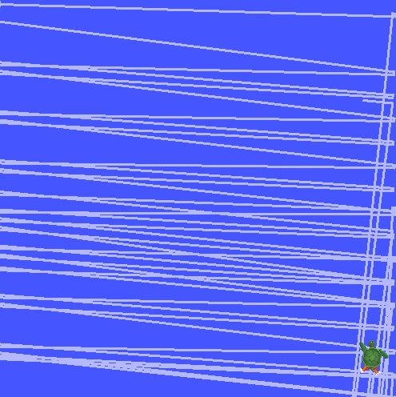

Here you can find project documentation, source code, and other fun content.

## Dice Sorting Robot

* [Dice Sorting]{:.heading.flip-title} --- Detecting dice and sorting them with an ABB robot arm

## Edge Detection in TurtleSim with ROS

* [Edge Detection]{:.heading.flip-title} --- Edge detection in TurtleSim node using custom ROS package

## Email scripting

* [Email]{:.heading.flip-title} --- Basic email automation using smtplib 

## Personal Website

* [Website]{:.heading.flip-title} --- How I created such an amazing site

[website]: website.md
[email]: email.md
[Edge Detection]: turtlesim.md
[Dice Sorting]: dicesort.md

