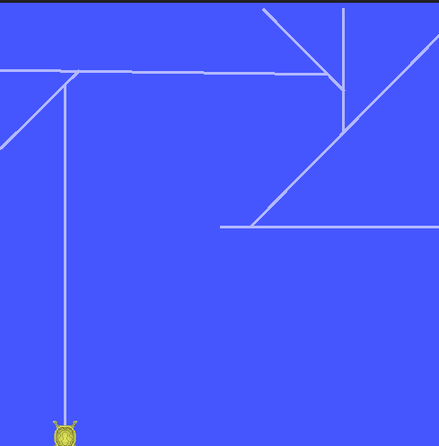

Once you have Linux set up and running and have successfully ran and controlled the turtle sim node you can start writing custom nodes. Here you can find a brief walkthrough on creating and building an edge detection ROS node for TurtleSim

## Creating a package

First we will create our package and node. While in the ros2_ws we can enter the following into the terminal:

~~~bash
ros2 pkg create --build-type ament_cmake --license Apache-2.0 --node-name edge_detect edge_detection
~~~

When you run this command, it creates a new ROS 2 package named "edge_detection" with the specified build system, license, and main node name. We now should have a folder in the ros2_ws/src directory called edge_detection

Your package folder should look like this:

We should have a file in our edge_detection/src folder called edge_detect. 

## Modifying node

This is the node we can write code in. We now need to update both the edge_detect.cpp file and the CMake.txt file. First we will write the following into our edge_detect.cpp file:

~~~cpp
#include "rclcpp/rclcpp.hpp"
#include "geometry_msgs/msg/twist.hpp"
#include "turtlesim/msg/pose.hpp"

using namespace std::chrono_literals;

// Global variable to store the previous theta value

void pose_callback(const turtlesim::msg::Pose::SharedPtr msg, const rclcpp::Node::SharedPtr node,
                   rclcpp::Publisher<geometry_msgs::msg::Twist>::SharedPtr publisher) {
    static bool is_rotating = false; // Flag to indicate if the turtle is rotating
    static float initial_angle = 0.0; // Static variable to store the initial angle

    // Check if the turtle is near the edge
    if (msg->x <= 0.01 || msg->x >= 10.99 || msg->y <= 0.01 || msg->y >= 10.99) {
        // If the turtle is not already rotating, initiate rotation
        if (!is_rotating) {
            geometry_msgs::msg::Twist twist;
            twist.linear.x = 0; // Stop
            twist.angular.z = -5.0; // Rotate
            publisher->publish(twist);
            printf("Edge detected\n");
            initial_angle = msg->theta; // Store the initial angle
            is_rotating = true; // Set the flag to indicate rotation
        }
        // Check if the turtle has rotated 90 degrees from the initial angle
        if (std::abs(msg->theta - initial_angle) >= 1.570796) { // 90 degrees in radians
            // If rotation is completed, initiate forward movement
            geometry_msgs::msg::Twist twist;
            twist.linear.x = 5; // Drive forward
            twist.angular.z = 0.0; // No rotation
            publisher->publish(twist);
            // std::this_thread::sleep_for(std::chrono::milliseconds(100));
            is_rotating = false; // Reset the flag
        }
    } else {
        // If the turtle is not near the edge, initiate forward movement
        geometry_msgs::msg::Twist twist;
        twist.linear.x = 5; // Drive forward
        twist.angular.z = 0.0; // No rotation
        publisher->publish(twist);
        is_rotating = false; // Reset the flag
    }
}

int main(int argc, char * argv[]) {
    rclcpp::init(argc, argv);
    auto node = rclcpp::Node::make_shared("edge_detector");

    auto publisher = node->create_publisher<geometry_msgs::msg::Twist>("/turtle1/cmd_vel", 10);
    
    auto subscription = node->create_subscription<turtlesim::msg::Pose>(
        "/turtle1/pose", 10, 
        [node, publisher](const turtlesim::msg::Pose::SharedPtr msg) {
            pose_callback(msg, node, publisher);
        });

    rclcpp::spin(node);

    rclcpp::shutdown();

    return 0;
}
~~~

However this code will not work until we modify our CMake.txt file with the following:

~~~cpp
cmake_minimum_required(VERSION 3.5)
project(edge_detection)alt text

# Default to C99
if(NOT CMAKE_C_STANDARD)
  set(CMAKE_C_STANDARD 99)
endif()

# Default to C++17
if(NOT CMAKE_CXX_STANDARD)
  set(CMAKE_CXX_STANDARD 17)
endif()

if(CMAKE_COMPILER_IS_GNUCXX OR CMAKE_CXX_COMPILER_ID MATCHES "Clang")
  add_compile_options(-Wall -Wextra -Wpedantic)
endif()

# Find dependencies
find_package(ament_cmake REQUIRED)
find_package(rclcpp REQUIRED)
find_package(geometry_msgs REQUIRED)
find_package(turtlesim REQUIRED)

# Add executable
add_executable(edge_detect src/edge_detect.cpp)

# Link against ROS 2 libraries
target_link_libraries(edge_detect
  ${rclcpp_LIBRARIES}
  ${geometry_msgs_LIBRARIES}
  ${turtlesim_LIBRARIES}
)

# Include directories
target_include_directories(edge_detect PUBLIC
  $<BUILD_INTERFACE:${CMAKE_CURRENT_SOURCE_DIR}/include>
  $<INSTALL_INTERFACE:include>
  ${rclcpp_INCLUDE_DIRS}
  ${geometry_msgs_INCLUDE_DIRS}
  ${turtlesim_INCLUDE_DIRS}
)

# Install executable
install(TARGETS edge_detect
  DESTINATION lib/${PROJECT_NAME})

# Add ament package
ament_package()
~~~

## Building packages

Now with these files updated we can cd to our ~/ros_ws and build our fancy new package with colcon build like so:

~~~bash
colcon build --packages-select edge_detection
~~~

This will only build our new package, you can also run colcon build but specifying the package saves some time

Now we also need to source our setup.bash file with the following:

~~~bash
source install/setup.bash         
~~~

# Running the node

Finally we can test our code! Lets first open the turtlesim node with the following:

~~~bash
ros2 run turtlesim turtlesim_node
~~~

Now we can test our node with:

~~~bash
ros2 run edge_detection edge_detect
~~~

Look at our little turtle go :)

