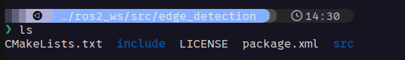

Once you have Linux set up and running and have successfully ran and controlled the turtle sim node you can start writing custom nodes. Here you can find a brief walkthrough on creating and building an edge detection ROS node for TurtleSim

## Creating a package

First we will create our package and node. While in ros2_ws/src we can enter the following into the terminal:

~~~bash
ros2 pkg create --build-type ament_cmake --license Apache-2.0 --node-name edge_detect turtlesimAutomata
~~~

When you run this command, it creates a new ROS 2 package named "turtlesimAutomata" with the specified build system, license, and main node name. We now should have a folder in the ros2_ws/src directory called turtlesimAutomata

Your package folder should look like this:

We should have a file in our turtlesimAutomata/src folder called edge_detect. 

## Modifying node

This is the node we can write code in. We now need to update both the edge_detect.cpp file and the CMake.txt file. First we will write the following into our edge_detect.cpp file:

~~~cpp
// include all of our necessary libraries
#include "rclcpp/rclcpp.hpp"
#include "geometry_msgs/msg/twist.hpp"
#include "turtlesim/msg/pose.hpp"
#include "turtlesim/srv/teleport_absolute.hpp"
#include <random>

// define namespace
using namespace std::chrono_literals;

// this function starts the turtle at a random angle in the center of the screen. It uses the teleport_absolute service
void teleportTurtle(const rclcpp::Node::SharedPtr& node) {

    //define our service node
    auto turtleTeleport = node->create_client<turtlesim::srv::TeleportAbsolute>("turtle1/teleport_absolute");

    // state our x and y teleport target
    auto request = std::make_shared<turtlesim::srv::TeleportAbsolute::Request>();
    request->x = 5.5;
    request->y = 5.5;

    // Generate a random initial angle between 0 and 360 degrees
    std::random_device rd;
    std::mt19937 gen(rd());
    std::uniform_real_distribution<float> dis(0, 2 * M_PI); // Define the range for angle in radians
    request->theta = dis(gen); // Set the random angle

    // run the service and output whether it was successful or not
    while (!turtleTeleport->wait_for_service(1s)) {
        if (!rclcpp::ok()) {
            RCLCPP_ERROR(node->get_logger(), "Interrupted while waiting for service to appear.");
            return;
        }
        RCLCPP_INFO(node->get_logger(), "service not available, waiting again...");
    }

    auto result = turtleTeleport->async_send_request(request);
    if (rclcpp::spin_until_future_complete(node, result) != rclcpp::FutureReturnCode::SUCCESS) {
        RCLCPP_ERROR(node->get_logger(), "Failed to teleport turtle");
    } else {
        RCLCPP_INFO(node->get_logger(), "Turtle teleportation completed");
    }
}

// this is our edge detection function, it relies on the x and y postiton of the turtle to determine if it is inbounds or not
void pose_callback(const turtlesim::msg::Pose::SharedPtr msg, const rclcpp::Node::SharedPtr node,
                   rclcpp::Publisher<geometry_msgs::msg::Twist>::SharedPtr publisher) {
    static bool is_rotating = false; // Flag to indicate if the turtle is rotating
    static float initial_angle = 0.0; // Static variable to store the initial angle

    // Check if the turtle is near the edge
    if (msg->x <= 0 || msg->x >= 11 || msg->y <= 0 || msg->y >= 11) {
        // If the turtle is not already rotating, initiate rotation
        if (!is_rotating) {
            geometry_msgs::msg::Twist twist;
            twist.linear.x = 0; // Stop
            twist.angular.z = -5.0; // Rotate
            publisher->publish(twist);
            printf("Edge detected\n");
            initial_angle = msg->theta; // Store the initial angle
            is_rotating = true; // Set the flag to indicate rotation
        }
        // Check if the turtle has rotated 90 degrees from the initial angle
        if (std::abs(msg->theta - initial_angle) >= 1.570796) { // 90 degrees in radians
            // If rotation is completed, initiate forward movement
            geometry_msgs::msg::Twist twist;
            twist.linear.x = 5; // Drive forward
            twist.angular.z = 0.0; // No rotation
            publisher->publish(twist); // Publish the move instruction to stop rotating 
            is_rotating = false; // Reset the flag
        }
    } else {
        // If the turtle is not near the edge, initiate forward movement
        geometry_msgs::msg::Twist twist;
        twist.linear.x = 5; // Drive forward
        twist.angular.z = 0.0; // No rotation
        publisher->publish(twist);
        is_rotating = false; // Reset the flag
    }
}

bool initial_state = true; // boolian flag to determine if we are in our inital state

// main loop that will run our code
int main(int argc, char * argv[]) {
    rclcpp::init(argc, argv);
    // start node
    auto node = rclcpp::Node::make_shared("edge_detector");

    // check to see if code has run already, if not we define starting postion for turtle
    if (initial_state == true){
        printf("Starting\n");
        teleportTurtle(node);  // start turtle with random thetea
        initial_state = false; // reset boolian flag
    }

    // publish twist 
    auto publisher = node->create_publisher<geometry_msgs::msg::Twist>("/turtle1/cmd_vel", 10);
    
    // subscribe to turtle pose
    auto subscription = node->create_subscription<turtlesim::msg::Pose>(
        "/turtle1/pose", 10, 
        [node, publisher](const turtlesim::msg::Pose::SharedPtr msg) {
            pose_callback(msg, node, publisher);
        });

    rclcpp::spin(node);

    rclcpp::shutdown();

    return 0;
}
~~~

However this code will not work until we modify our CMake.txt file with the following:

~~~cpp
cmake_minimum_required(VERSION 3.5)
project(turtlesimAutomata)

# Default to C++17
if(NOT CMAKE_CXX_STANDARD)
  set(CMAKE_CXX_STANDARD 17)
endif()

# Find dependencies
find_package(ament_cmake REQUIRED)
find_package(rclcpp REQUIRED)
find_package(geometry_msgs REQUIRED)
find_package(turtlesim REQUIRED)
find_package(std_srvs REQUIRED)  # Add this line to find the std_srvs package

# Add executable
add_executable(edge_detect src/edge_detect.cpp)

# Link against ROS 2 libraries
target_link_libraries(edge_detect
  ${rclcpp_LIBRARIES}
  ${geometry_msgs_LIBRARIES}
  ${turtlesim_LIBRARIES}
  ${std_srvs_LIBRARIES}  # Link against std_srvs library
)

# Include directories
target_include_directories(edge_detect PUBLIC
  $<BUILD_INTERFACE:${CMAKE_CURRENT_SOURCE_DIR}/include>
  $<INSTALL_INTERFACE:include>
  ${rclcpp_INCLUDE_DIRS}
  ${geometry_msgs_INCLUDE_DIRS}
  ${turtlesim_INCLUDE_DIRS}
  ${std_srvs_INCLUDE_DIRS}  # Include std_srvs headers
)

# Suppress deprecated declaration warnings
add_compile_options(-Wno-deprecated-declarations)

# Install executable
install(TARGETS edge_detect
  DESTINATION lib/${PROJECT_NAME})

# Add ament package
ament_package()
~~~

## Building packages

Now with these files updated we can cd to our ~/ros_ws and build our fancy new package with colcon build like so:

~~~bash
colcon build --packages-select turtlesimAutomata
~~~

This will only build our new package, you can also run colcon build but specifying the package saves some time

Now we also need to source our setup.bash file with the following:

~~~bash
source install/setup.bash         
~~~

# Running the node

Finally we can test our code! Lets first open the turtlesim node with the following:

~~~bash
ros2 run turtlesim turtlesim_node
~~~

Now we can test our node with:

~~~bash
ros2 run turtlesimAutomata edge_detect
~~~

Look at our little turtle go :o

I also wrote this bash script to automate the install and running of this node, code below:

~~~ BASH
#!/bin/sh

# Make directory
mkdir ~/ros2_ws/src

# Copy Content
cp -r ~/Downloads/liam_nolan/turtlesimAutomata ~/ros2_ws/src

# Remove folder and files
rm -r ~/Downloads/liam_nolan

# Run turtle sim node
gnome-terminal -- bash -c "source ~/.bashrc;cd ~/ros2_ws;ros2 run turtlesim turtlesim_node"

# Run Edge detection node
gnome-terminal -- bash -c "cd ~/ros2_ws; sleep .5; colcon build --packages-select turtlesimAutomata; source install/setup.bash;ros2 run turtlesimAutomata edge_detect
"
~~~